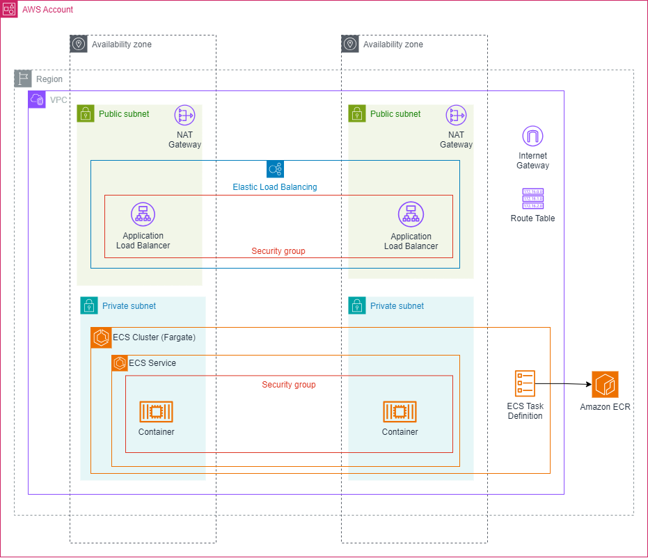

# CICD System Design
## High-Level Overview


# Startup
Running CICD
```shell
docker compose up -d
```

Get the initial admin password by running
```shell
docker compose exec jenkins sh -c 'cat /var/jenkins_home/secrets/initialAdminPassword'
```

Go to `http://<DOCKER_HOST>:8080/blue` and enter the password from the previous step

# Deploying ECR
```shell
aws --profile dev cloudformation deploy --template-file ./cloudformation/ecr.yaml --stack-name ECR --parameter-overrides UserArns="<USER_ARN>"
```

# Deploying ECS
```shell
aws --profile dev cloudformation deploy --template-file ./cloudformation/ecs.yaml --stack-name ECS --parameter-overrides ImageName="<DEPLOYABLE_IMAGE_FROM_ECR>"
```

# References
Installing compose standalone 
- https://docs.docker.com/compose/install/standalone/

Working with Jenkins plugins
- https://github.com/fabric8io/jenkins-docker/blob/master/plugins.txt
- https://hub.docker.com/r/jenkinsci/blueocean
- https://hub.docker.com/r/jenkins/jenkins
- https://stackoverflow.com/questions/9815273/how-to-get-a-list-of-installed-jenkins-plugins-with-name-and-version-pair
- https://gist.github.com/noqcks/d2f2156c7ef8955619d45d1fe6daeaa9

Installing Jenkins with Docker
- https://www.jenkins.io/doc/book/installing/docker/

# ECS and ECR
- https://docs.aws.amazon.com/AmazonECS/latest/developerguide/ECS_AWSCLI_Fargate.html
- https://docs.aws.amazon.com/AmazonECS/latest/developerguide/creating-resources-with-cloudformation.html
- https://docs.aws.amazon.com/AmazonECS/latest/developerguide/example_task_definitions.html#example_task_definition-iam
- https://docs.aws.amazon.com/AmazonECS/latest/developerguide/AWS_Fargate.html
- https://github.com/aws-samples/ecs-refarch-cloudformation

## ECS IAM
- https://docs.aws.amazon.com/AmazonECS/latest/developerguide/task_execution_IAM_role.html

## AWS Configs
- https://docs.aws.amazon.com/cli/latest/userguide/cli-usage-pagination.html#cli-usage-pagination-nopaginate

## Reference Architectures
- https://docs.aws.amazon.com/prescriptive-guidance/latest/patterns/deploy-an-environment-for-containerized-blu-age-applications-by-using-terraform.html?did=pg_card&trk=pg_card