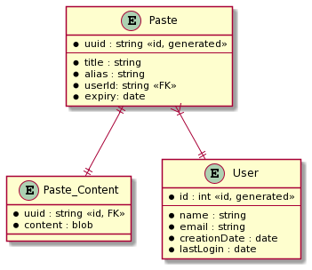
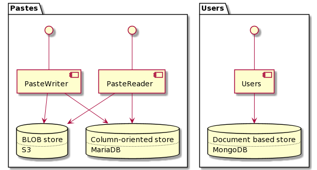
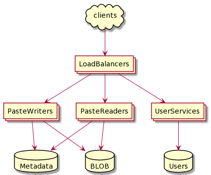

# Pastebin

## Functional Requirements
* Users can upload text and get a unique URL
* Pastes should expire over time. Expiration can be customized
* A paste can be additionally protected with a specified password
* A custom URL alias can be picked for the paste if it's not taken

## Non-functional requirements

_Consistency_
* Each paste should have a unique ID assigned.
* We don't have a limitation on the ID's length. It can be shortened if required (the solution is identical to the previous exercise).

_Performance_
* Reading and creating pastes (read/write) should be performing differently based on different read/write performance requirements.
* Popular pastes should be cached, but warmup period should not affect overall read performance.

_Scalability_
* Every component should be individually horizontally scalable.
* Reading and creating pastes (read/write) should be independently scalable.

_Reliability_
* There shouldn't be any single point of failure for any component.
* System should tolerate failure of writes/reads independently.

_Security_
- Paste URLs should not be guessed by unauthorized users by a simple enumeration. 

_Observability_
The following data should be measured and collected:
- New pastes / second
- Paste reads / second
- Storage capacity
- Memory usage / application
- Memory usage / cache

_Auditability_
- We should collect popularity of each paste for further analysis and collecting usage statistics.
- A specific user is a power-user if that person's average paste reaches 1,000,000 views. 

## Capacity Estimations
* Assuming 25 million new pastes per month and 10:1 read:write ratio.
* Assuming 1,000 new registered users per month (most of them like to send pastes anonymously).
* Assuming, that the maximum size of a paste can be 5 MB.
* Assuming the average size of a paste is not more than 25 KB.
* We should store each paste for 2 years at maximum.
* We can use 80:20 rule for caching capacity.

|   Requirement  | Measure    |
| --- | --- |
|New pastes|	9.64/s|
|Paste reads|	96.4/s|
|Maximum incoming data|	48.2 MB/s|
|Maximum outgoing data|	482 MB/s|
|Average incoming data|	241 KB/s|
|Average outgoing data|	2.4 MB/s|
|Paste BLOB storage for 2 years (with 25KB average size)|	15 TB|
|Paste metadata storage for 2 years (with 1.5KB average size)|	900 GB|
|User storage for 5 years (with 1.5KB average size)|	90 MB|
|Memory for cache|	4.1 GB|

## API Design
OpenAPI documentation is available in the [open-api.yaml](open-api.yaml) file.

## Data Model

Each paste can be stored in 5 MB at maximum, so if we keep the pastes for 2 years we will need 15 TB of total database storage. Although 5 MB for each row doesn't seem to be much, the paste content can be decoupled from the metadata of each paste. You can store the paste metadata in a specific NoSQL storage type and use a different storage type for binary data (BLOB storage), like S3.

This means that our components serving the paste content will have to connect to two different storage engines and aggregate the results in-place. The aggregation takes time, so it's more efficient to cache the aggregated results.

### Capacity Estimates
The 900 GB of storage space for metadata is not considered significantly large.
[MongoDB](https://docs.mongodb.com/manual/reference/limits/#data) or [MariaDB](https://mariadb.com/kb/en/innodb-limitations/)
can handle database sizes up to 4-8 TB for sure. So we're not bound to use a columnar store, like Cassandra for these purposes.

For the purpose of the exercise, I'll use MariaDB for the metadata store.
Just to have as many kind of databases showcased as possible. 

### Caching
Caching is easier to do after aggregation to avoid recalculation. Multi-level caches.

## References 
