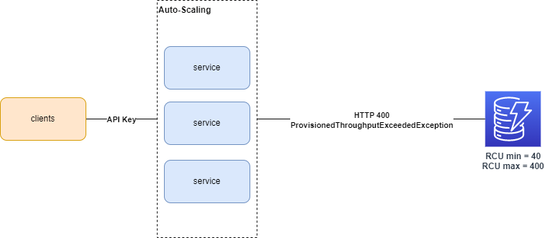
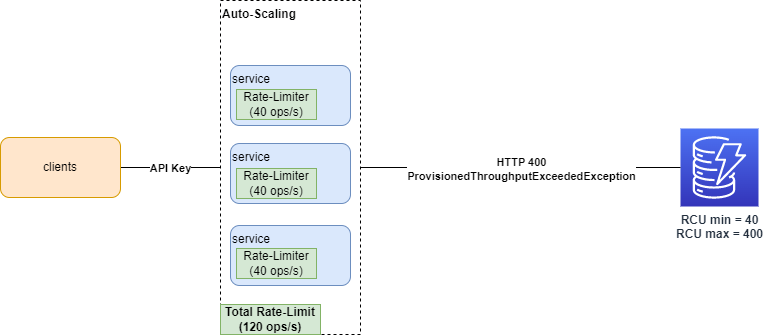
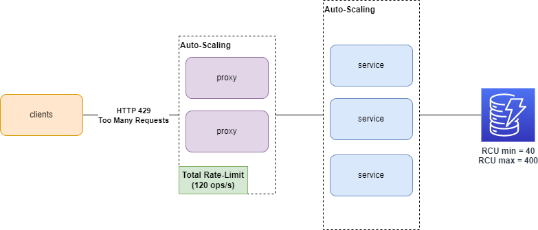

# Implementing Backpressure & Rate Limiting with RabbitMQ

## High-Level Requirements

Client requests are arriving at a higher rate, than the [provisioned capacity unit](https://docs.aws.amazon.com/amazondynamodb/latest/developerguide/HowItWorks.ReadWriteCapacityMode.html#HowItWorks.ProvisionedThroughput.Manual) of the underlying DynamoDB service. For a certain proportion of the requests, the database is starting to throttle and responds with HTTP 400 `ProvisionedThroughputExceededException`.

We would like to implement backpressure on the server side, which slows down the arrival rate to the desired level: If the provisioned RCU for DynamoDB is 200, then the read throughput of the service is 800 reads/sec at maximum.

The implementation should also provide a fair share of capacity for their clients using their API keys. So if one of the clients is misbehaving, it's not going to affect others from getting a response ([noisy neighbor antipattern](https://learn.microsoft.com/en-us/azure/architecture/antipatterns/noisy-neighbor/noisy-neighbor).

The solution should also scale properly:

- New clients can arrive with a previously unseen API key.
- Rate-limiting rules are global: If our services start to scale out, the allowed capacity per API key should remain the same.

The solution should introduce a non-breaking change:
- If limit is reached for a consumer their request rate are just slowed down instead of dropped.
- Clients can choose to just wait for a longer period still be able to retrieve results.



## Implementation Algorithms and Examples
### [Token Bucket](https://en.wikipedia.org/wiki/Token_bucket)

- [DynamoDB](https://www.youtube.com/watch?v=yvBR71D0nAQ&t=1340s)

- [AWS Rate-Limiting](https://d1.awsstatic.com/builderslibrary/pdfs/fairness-in-multi-tenant-systems-david-yanacek.pdf)

### [Leaky Bucket](https://en.wikipedia.org/wiki/Leaky_bucket)

### Fixed Window Counter 
- [Example with Redis](https://redis.com/redis-best-practices/basic-rate-limiting/)

### Sliding Window Counter & Log
- [Example with Redis](https://redis.com/redis-best-practices/time-series/sorted-set-time-series/)
- [Another Example with Redis](https://engineering.classdojo.com/blog/2015/02/06/rolling-rate-limiter/)


## Design Considerations
### Builtin Rate-Limiter Inside the Service
We could use a simple rate-limiter implementation inside each service, configured to a fixed rate. [Resilience4J implementation](https://resilience4j.readme.io/docs/ratelimiter) is a good example. This won't satisfy the "global rate-limiting" requirement as the allowed capacity will increase/decrease by scaling the service in & out.



### Rate-Limiting with Service Mesh
A better solution would be to have a centralized place to apply rate limits. [Envoy](https://www.envoyproxy.io/docs/envoy/latest/intro/arch_overview/other_features/global_rate_limiting#per-connection-or-per-http-request-rate-limiting) and [Istio](https://istio.io/latest/docs/tasks/policy-enforcement/rate-limit/) offers global rate limiting by keeping track of current utilization in Redis. 

Local rate limits, like the ones offered by [Traefik Proxy](https://doc.traefik.io/traefik/middlewares/http/ratelimit/) are not applicable for the same reasons as above. [Linkerd](https://github.com/linkerd/linkerd2/issues/7278) is [not](https://github.com/linkerd/linkerd2/issues/6323) yet offering any option for rate-limiting.

The solutions above will drop requests immediately and respond with an HTTP error if limit is reached for a specific API key. So clients have no option to just wait for their response. They need to retry.



### Delegating to DynamoDB & Retry


### Rate-Limiting with RabbitMQ


#### Using Queue Length Limits
See https://www.rabbitmq.com/maxlength.html

# Running the Sandbox
Use [SDKMan](https://sdkman.io/usage) to set the proper Java version.
```shell
sdk env
```
Run all dependencies with Docker compose
```shell
docker compose up -d
```
Inject mock data to DynamoDB
```shell
src/main/docker/dynamodb/init.sh
```
Run the service with Gradle (slow)
```shell
./gradlew -p service run
```
Run the worker with Gradle (slow)
```shell
./gradlew -p worker run
```
Dockerizing both service and worker for performance testing
```shell
./gradlew publishImageToLocalRegistry
```
Run service & workers for performance testing
```shell
docker compose --profile perf up -d 
```

Run the performance tests
```shell
cd src/main/docker/k6
npm run docker-direct
```

## HTTP Requests
You can use the following examples to get values directly and asynchronously through HTTP API.
See [`src/main/docker/dynamodb/data/data_1.json`](src/main/docker/dynamodb/data/data_1.json) for the keys inserted to DynamoDB.

### Getting values through messaging
- http://localhost:8080/async/key?id=key1&apiKey=api_one
- http://localhost:8080/async/key?id=key2&apiKey=api_two

### Getting values directly
- http://localhost:8080/direct/key?id=key1&apiKey=api_one
- http://localhost:8080/direct/key?id=key2&apiKey=api_two

## Reviewing Metrics
Go to http://localhost:3000/d/kk8cQRJVz/rate-limiting-service

# References

## DynamoDB Kotlin

https://docs.aws.amazon.com/sdk-for-kotlin/latest/developer-guide/kotlin_dynamodb_code_examples.html

https://github.com/bexway/kotlin-spring-dynamo-example/tree/master/src/main/kotlin/com/shoprunner/kotlinspringdynamoexample

## DynamoDB Local

https://hub.docker.com/r/amazon/dynamodb-local

https://docs.aws.amazon.com/amazondynamodb/latest/developerguide/DynamoDBLocal.UsageNotes.html

https://github.com/aws-samples/aws-sam-java-rest

## Allow WSL2 to connect to Windows host
https://superuser.com/questions/1535269/how-to-connect-wsl-to-a-windows-localhost

https://superuser.com/questions/1679757/how-to-access-windows-localhost-from-wsl2


## k6 With TypeScript Template

https://k6.io/docs/testing-guides/api-load-testing/

https://github.com/grafana/k6-template-typescript

## RabbitMQ using Kotlin

https://medium.com/swlh/async-messaging-with-kotlin-and-rabbitmq-d69df1937b25

https://www.rabbitmq.com/tutorials/tutorial-six-java.html

https://github.com/rabbitmq/rabbitmq-tutorials/blob/main/kotlin/src/main/kotlin/RPCServer.kt

