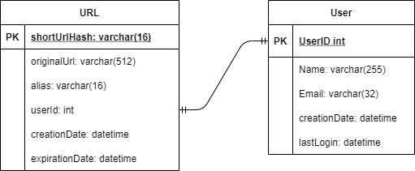
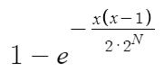
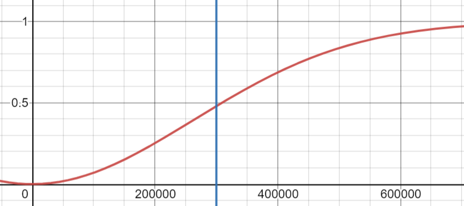
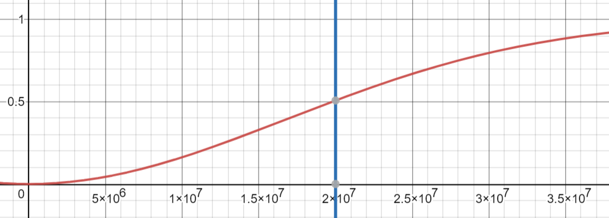
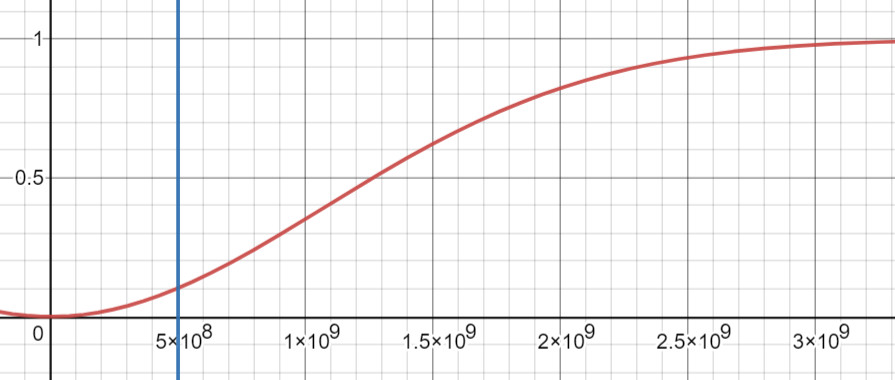

# TinyURL

## Functional Requirements
* Shortened URLs should be unique
* Expiration should be considered for shortened URLs
* A custom text can be picked for shortened URLs

## Non-functional Requirements
_Performance_
* The URL resolution should happen near real-time.
* Reading and creating shortened URLs (read/write) should be separated
* URL resolution should be cached, but warmup period should not affect overall read performance

_Availability_
* There shouldn't be any single point of failure for any component
* System should tolerate failure of writes/reads independently

_Scalability_
* Every component should be individually horizontally scalable
* Reading and creating shortened URLs (read/write) should be independently scalable

_Observability_
The following data should be measured and collected:
- New URLs created
- Total redirections
- New URLs / second
- URL redirections / second
- Storage capacity
- Memory usage / application
- Memory usage / distributed cache

_Consistency_
There should be a one-to-one mapping between a shortened URL and its longer version.
Hash collisions should be resolved before the final value of the data is persisted.

## High-level estimates

Assuming 500 million new URLs per month and 100:1 read:write ratio.

|   Requirement  | Measure    |
| --- | --- |
|New URLs|	200/s|
|URL redirections|	20K/s|
|Incoming data|	100KB/s|
|Outgoing data|	10MB/s|
|Storage for 5 years|	15TB|
|Memory for cache|	170GB|

## API

OpenAPI documentation is available in the [open-api.yaml](open-api.yaml) file.

## Data Model


A key-value store would be a good choice for storing the data, because there's not much relation between
the entities and no need for complicated queries based on the API.

We have to avoid assigning the same shortened URL to multiple requests, so the application needs
to check if the key for the URL is already present.

A key-value store with CP characteristics from CAP would be the best choice.
Because consistency [can be provided various ways](http://jepsen.io/consistency), we can try to reduce the possibility of key collisions
instead of aiming for strong consistency.

Riak allows us to store every version of a key individually by providing [siblings](https://docs.riak.com/riak/kv/latest/developing/usage/conflict-resolution/index.html#siblings),
so we can actively monitor the number of key collisions during tests. 

### Probability of key collisions
[Base64](https://en.wikipedia.org/wiki/Base64#Base64_table) table provides 64 characters
stored in 6 bits, so a 6 character long key will result as a hashing with 36 bits.

We can calculate the [collision probabilities](https://preshing.com/20110504/hash-collision-probabilities/) with
the formula below. N represents the length of the hash in bits.



With the lenght of 6 characters bits we will face a 50% chance of key collision after storing 300,000 URLs.


The chances will be better with 8 character long keys, we will face the same issue after 20,000,000 URLs stored.
Seeing that we plan to have 500,000,000 new keys per month, we will have problems after 2 days in production.


With 10 character long keys we will still have around 10% chance of collision after one month:


The calculator can be viewed at:
https://www.desmos.com/calculator/v254ajn3bf

### Relying on Database mechanism
Riak is able to [assign random keys](https://docs.riak.com/riak/kv/latest/developing/usage/creating-objects/index.html#store-a-new-object-and-assign-a-random-key) automatically
but this will bind our key generation algorithm to a specific data store.
Also note, that the random key is 28 characters long, and we can't truncate it. So this solution is not advisable.

## Telemetry

## Caching
https://gist.github.com/jboner/2841832
- Ignite, Hazelcast, Infinispan, EhCache

## Load Balancing


## Hash Operations Benchmark
The benchmark can be executed with
```shell
./gradlew clean build jmhJar
java -jar ./shortener/build/libs/shortener-0.0.1-SNAPSHOT-jmh.jar UrlShortenerBenchmark -f 1
```

Results
```
Result "service.UrlShortenerBenchmark.benchmarkShorten":
  418224.978 ±(99.9%) 102076.997 ops/s [Average]
  (min, avg, max) = (378526.417, 418224.978, 443561.668), stdev = 26509.072
  CI (99.9%): [316147.981, 520301.976] (assumes normal distribution)
```


## Starting the application 
Use the following command:
```bash
make
```
Running end-to-end tests requires Taurus being installed. It can be done with the following:
```bash
make e2e
```

### Endpoint URLs

Riak admin UI is available at: http://DOCKER_HOST_IP:8098/admin
Traefik admin UI is available at: http://DOCKER_HOST_IP:8080
Grafana UI is available at: http://DOCKER_HOST_IP:3000

Swagger UI for shortener is available at: http://localhost:8080/v1/swagger-ui.html
Swagger UI for resolver is available at: http://localhost:8081/v1/swagger-ui.html

Both resolver and shortener can be accessed via Traefik using port 80.
```bash
curl -X POST -H "Content-Type: application/json" \
 -d '{"originalUrl":"https://google.com"}' \
 http://192.168.99.100
```

```bash
curl  http://192.168.99.100/mZmevP
```

### Scaling out specific services
Scaling applications (needs lots of resources by the way)
```bash
docker-compose scale member=2 resolver=2
```

## References and Docs

### Riak
https://docs.riak.com/riak/kv/2.2.3/developing/getting-started/java/index.html
https://hub.docker.com/r/basho/riak-kv
https://github.com/spring-projects/spring-data-keyvalue
https://docs.spring.io/spring-data/data-keyvalue/riak/docs/current/reference/html/#reference
https://github.com/basho-labs/riak-key-list-util
http://basho-labs.github.io/riak_explorer/docs/api.html
https://riak.com/posts/technical/running-riak-in-docker/index.html

### Reactive Spring and RSocket
https://rsocket.io/
https://docs.spring.io/spring-boot/docs/2.4.4/reference/html/spring-boot-features.html#boot-features-webflux
https://docs.spring.io/spring-framework/docs/5.3.5/reference/html/web-reactive.html#spring-webflux
https://projectreactor.io/docs/core/release/reference
https://www.codota.com/code/java/methods/reactor.test.StepVerifier$Step/expectErrorSatisfies

### Java Microbenchmark Harness
https://github.com/openjdk/jmh
https://github.com/melix/jmh-gradle-plugin

### API specification
https://springdoc.org/

### AssertJ and testing
https://joel-costigliola.github.io/assertj/assertj-core-features-highlight.html

### Micrometer
https://micrometer.io/docs/registry/prometheus
https://docs.spring.io/spring-boot/docs/current/reference/htmlsingle/#production-ready-metrics-export-prometheus
https://github.com/vegasbrianc/docker-traefik-prometheus/blob/master/prometheus/prometheus.yml

### Google Jib
https://github.com/GoogleContainerTools/jib/tree/master/examples/multi-module

### Traefik
https://doc.traefik.io/traefik/routing/routers/#rule
https://doc.traefik.io/traefik/middlewares/replacepath/

### Caching
http://highscalability.com/ehcache-java-distributed-cache
https://docs.spring.io/spring-boot/docs/current/reference/html/spring-boot-features.html#boot-features-caching