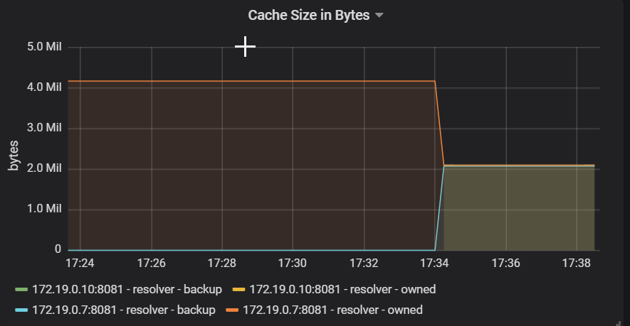

# TinyURL

## Functional Requirements
* Shortened URLs should be unique
* Expiration should be considered for shortened URLs
* A custom text can be picked for shortened URLs

## Non-functional Requirements
_Performance_
* The URL resolution should happen near real-time.
* Reading and creating shortened URLs (read/write) should be separated.
* URL resolution should be cached, but warmup period should not affect overall read performance.

_Availability_
* There shouldn't be any single point of failure for any component.
* System should tolerate failure of writes/reads independently.

_Scalability_
* Every component should be individually horizontally scalable.
* Reading and creating shortened URLs (read/write) should be independently scalable.

_Observability_
The following data should be measured and collected:
- New URLs created.
- Total redirections.
- New URLs / second.
- URL redirections / second.
- Storage capacity.
- Memory usage / application.
- Memory usage / distributed cache.

_Consistency_
There should be a one-to-one mapping between a shortened URL and its longer version.
Hash collisions should be resolved before the final value of the data is persisted.

## High-level estimates

Assuming 500 million new URLs per month and 100:1 read:write ratio. Let's also assume, that 
the size of one object is 500 bytes.

|   Requirement  | Measure    |
| --- | --- |
|New URLs|	200/s|
|URL redirections|	20K/s|
|Incoming data|	100KB/s|
|Outgoing data|	10MB/s|
|Storage for 5 years|	15TB|
|Memory for caching top 20% of daily URL redirections|	170GB|

## API

OpenAPI documentation is available in the [open-api.yaml](open-api.yaml) file.

## Data Model


A key-value store would be a good choice for storing the data, because there's not much relation between
the entities and no need for complicated queries based on the API.

We have to avoid assigning the same shortened URL to multiple requests, so the application needs
to check if the key for the URL is already present.

A key-value store with CP characteristics from CAP would be the best choice.
Because consistency [can be provided various ways](http://jepsen.io/consistency), we can try to reduce the possibility of key collisions
instead of aiming for strong consistency. This leaves us with technology choices, like Redis or Riak. 

Riak allows us to store every version of a key individually by providing [siblings](https://docs.riak.com/riak/kv/latest/developing/usage/conflict-resolution/index.html#siblings),
so we can actively monitor the number of key collisions during tests. 

### Probability of key collisions
[Base64](https://en.wikipedia.org/wiki/Base64#Base64_table) table provides 64 characters
stored in 6 bits, so a 6 character long key will result as a hashing with 36 bits.

We can calculate the [collision probabilities](https://preshing.com/20110504/hash-collision-probabilities/) with
the formula below. N represents the length of the hash in bits.


With the lenght of 6 characters bits we will face a 50% chance of key collision after storing 300,000 URLs.


The chances will be better with 8 character long keys, we will face the same issue after 20,000,000 URLs stored.
Seeing that we plan to have 500,000,000 new keys per month, we will have problems after 2 days in production.


With 10 character long keys we will still have around 10% chance of collision after one month:


The calculator can be viewed at:
https://www.desmos.com/calculator/v254ajn3bf

### Conclusion
In conclusion, I would say that a randomly assigned string which features more characters and uses all 8 bits
would cause less collision and perform much better, than [Base64](https://en.wikipedia.org/wiki/Base64#Base64_table).

### Relying on Database mechanism
Riak is able to [assign random keys](https://docs.riak.com/riak/kv/latest/developing/usage/creating-objects/index.html#store-a-new-object-and-assign-a-random-key) automatically
but this will bind our key generation algorithm to a specific data store.
Also note, that the random key is 28 characters long, and we can't truncate it. So this solution is not advisable.

## High Level Design
As I wrote earlier, we have to separate reads from writes for better scalability. A homogenic workload is always
easier to fine-tune and this way we can scale out writes independently of reads.


## Application stack
The nature of redirects bounds us to HTTP protocol. To reach near real-time performance
we have to choose a non-blocking reactive framework for serving the requests, like Vert.X, RxJava, Spring WebFlux or similar. 
For this particular project I chose Spring WebFlux.

## Telemetry
For building the metrics I chose to use OpenMetrics with Prometheus and Grafana. Many applications are offering their metrics
out-of-the hood in this format. 
Unfortunately Riak is an exceptions, so I had to use another external service, called [riak-exporter](https://github.com/anti1869/riak_exporter).

All the metrics dashboards are accessible after starting the containers with Docker compose.


## Caching
When choosing the right cache provider for the reads, we have to keep several things in mind.

We need an in-memory cache provider, so we don't have to pay additional penalty for the extra network hop.
The penalty does not seem much, but if we compare it to in-memory access we can say
that there's a two orders of magnitude difference between main memory access
and getting 1K bytes over a gigabit network. See [Latency Numbers Every Programmer Should Know](
https://gist.github.com/jboner/2841832) for further info.

This means, that we can't use distributed cache, like Redis. 
The candidates we have to consider are: Apache Ignite, Hazelcast, Infinispan, EhCache.

I chose Hazelcast, because it's providing [auto-discovery with IP multicast](https://docs.hazelcast.com/imdg/4.2/clusters/discovering-by-multicast.html)
so there's no additional component required for cluster membership management (like Zookeper).

Below there's a screenshot of the cache being repartitioned after a second instance of the resolver was started.




## Load Balancing
The load balancer should redirect workload in a round-robin fashion. 
Interpreting the HTTP payload for every request will increase latency, so it would be a good choice to 
use [Layer 4 (TCP)](https://www.envoyproxy.io/docs/envoy/latest/intro/arch_overview/listeners/tcp_proxy)
load-balancing instead of Layer 7 (HTTP) for redirecting shortened URLs. In practice Envoy was showing
lower performance when using Layer 4 load-balancing, so I just reverted to Layer 7.

Beside round-robin, Envoy offers [ring hash](https://www.envoyproxy.io/docs/envoy/latest/intro/arch_overview/upstream/load_balancing/load_balancers#ring-hash) load balancing
which consistently forwards each request to the appropriate host by hashing some property of the request.
This might result more cache hits but comes with the cost of using Layer 7 routing, and an additional hashing operation
at load-balancer level.


## Resilience
[Rate limiting](https://resilience4j.readme.io/docs/ratelimiter) should be introduced by each API key to ensure that bad behaving clients are not draining all
the resources. 
If we don't want to bound each API key to a specific instance, we need to use a [global rate limiter](https://www.envoyproxy.io/docs/envoy/latest/intro/arch_overview/other_features/global_rate_limiting)
which updates the statistics in a central storage (Memcached or Redis), so all the rate limits are in-sync. 
In this case rate limiting should be applied in load balancers and not in the URL resolving nodes themselves.

To increase the availability, we need to ensure that cached URLs are returned even if Riak nodes are unavailable.
A simple [circuit breaker](https://resilience4j.readme.io/docs/examples-1#decorate-mono-or-flux-with-a-circuitbreaker) is enough to implement this functionality.

## Performance Evaluation

### Hash Operations Benchmark
The benchmark can be executed with
```shell
./gradlew clean build jmhJar
java -jar ./shortener/build/libs/shortener-0.0.1-SNAPSHOT-jmh.jar UrlShortenerBenchmark -f 1
```

Results
```
Result "service.UrlShortenerBenchmark.benchmarkShorten":
  418224.978 ±(99.9%) 102076.997 ops/s [Average]
  (min, avg, max) = (378526.417, 418224.978, 443561.668), stdev = 26509.072
  CI (99.9%): [316147.981, 520301.976] (assumes normal distribution)
```

### Shortening Performance
Performance reached 500 ops/s for a single instance, so two instances from shortener nodes are enough.
This is only required to ensure high-availability. The P99 percentile of the response times can be kept
under 50ms.


### Resolution Performance
Just to be safe, we can assume that one instance can provide 1000 ops/s at-minimum if the URLs are cached locally.
I would estimate the number of nodes required to 20 nodes performing resolution and 20 Riak read replicas. 
The URL resolution seemed to be CPU hungry on both the instances and Riak read replicas, so autoscaling based on 
CPU metrics would help to optimize the cost.


### Cache Performance
27000 entries just cost 4 MB to cache, so one entity needs 148 bytes. With 20000 ops/s read performance in total, we would need
to cache 1,728,000,000 entities. Let's assume we can apply Pareto rule here, and we just need to cache the top 20% of the entities.
This leaves us with 51 GB to total cache space. The cache cost should be distributed across nodes, by applying
[ring hash](https://www.envoyproxy.io/docs/envoy/latest/intro/arch_overview/upstream/load_balancing/load_balancers#ring-hash) load balancing
to ensure that URL redirection is sent to the same node consistently. 


## Starting the application 
Use the following command:
```bash
make
```

If you have trouble starting the Riak coordinator node, just force-start it again:
```bash
docker-compose up -d --force coordinator
```

Running end-to-end tests requires Taurus being installed. 
You need to configure your Docker host and the test case in the `Makefile`.
Tests can be executed with the following command.
```bash
make e2e
```

### Endpoint URLs

Riak admin UI is available at: `http://DOCKER_HOST_IP:8098/admin`
Grafana UI is available at: `http://DOCKER_HOST_IP:3000`
Prometheus UI is available at: `http://DOCKER_HOST_IP:9090`

Swagger UI for shortener is available at: `http://localhost:8080/v1/swagger-ui.html`
Swagger UI for resolver is available at: `http://localhost:8081/v1/swagger-ui.html`

Both resolver and shortener can be accessed via Envoy using port 80.
```bash
curl -X POST -H "Content-Type: application/json" \
 -d '{"originalUrl":"https://google.com"}' \
 http://192.168.99.100/v1/url
```

```bash
curl  http://192.168.99.100/v1/url/mZmevP
```

### Scaling out specific services
Reads/Writes can be scaled out individually.
Because every request is load-balanced, instances does not need to be reconfigured and redeployed. 
Scaling applications with Docker(needs lots of resources by the way):
```bash
docker-compose scale member=2 resolver=2
```

## References and Docs

### Riak
https://docs.riak.com/riak/kv/2.2.3/developing/getting-started/java/index.html
https://hub.docker.com/r/basho/riak-kv
https://github.com/spring-projects/spring-data-keyvalue
https://docs.spring.io/spring-data/data-keyvalue/riak/docs/current/reference/html/#reference
https://github.com/basho-labs/riak-key-list-util
http://basho-labs.github.io/riak_explorer/docs/api.html
https://riak.com/posts/technical/running-riak-in-docker/index.html

### Reactive Spring and RSocket
https://rsocket.io/
https://docs.spring.io/spring-boot/docs/2.4.4/reference/html/spring-boot-features.html#boot-features-webflux
https://docs.spring.io/spring-framework/docs/5.3.5/reference/html/web-reactive.html#spring-webflux
https://projectreactor.io/docs/core/release/reference
https://www.codota.com/code/java/methods/reactor.test.StepVerifier$Step/expectErrorSatisfies

### Java Microbenchmark Harness
https://github.com/openjdk/jmh
https://github.com/melix/jmh-gradle-plugin

### API specification
https://springdoc.org/

### AssertJ and testing
https://joel-costigliola.github.io/assertj/assertj-core-features-highlight.html

### Micrometer
https://micrometer.io/docs/registry/prometheus
https://docs.spring.io/spring-boot/docs/current/reference/htmlsingle/#production-ready-metrics-export-prometheus
https://github.com/vegasbrianc/docker-traefik-prometheus/blob/master/prometheus/prometheus.yml

### Google Jib
https://github.com/GoogleContainerTools/jib/tree/master/examples/multi-module

### Envoy
https://www.envoyproxy.io/docs/envoy/latest/intro/arch_overview/upstream/load_balancing/load_balancers#ring-hash
https://www.envoyproxy.io/docs/envoy/latest/intro/arch_overview/arch_overview
https://www.envoyproxy.io/docs/envoy/latest/intro/arch_overview/listeners/tcp_proxy

### Caching
http://highscalability.com/ehcache-java-distributed-cache
https://docs.spring.io/spring-boot/docs/current/reference/html/spring-boot-features.html#boot-features-caching
https://docs.spring.io/spring-boot/docs/current/reference/html/spring-boot-features.html#boot-features-hazelcast
https://docs.spring.io/spring-boot/docs/current/reference/html/production-ready-features.html#production-ready-metrics-cache
https://guides.hazelcast.org/caching-springboot/

### Resilience4J
https://resilience4j.readme.io/docs
https://resilience4j.readme.io/docs/examples-1